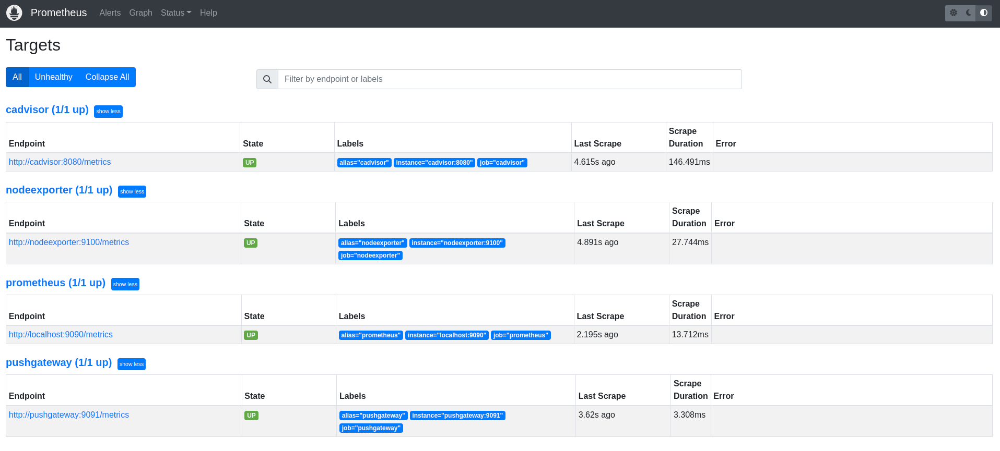
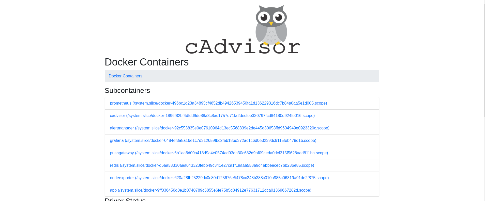
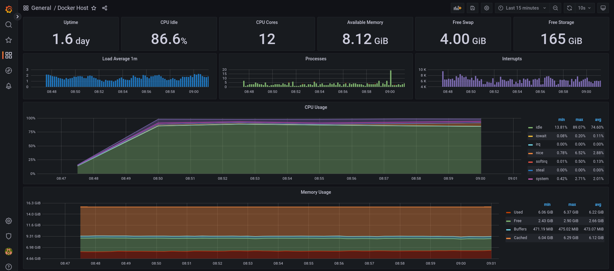
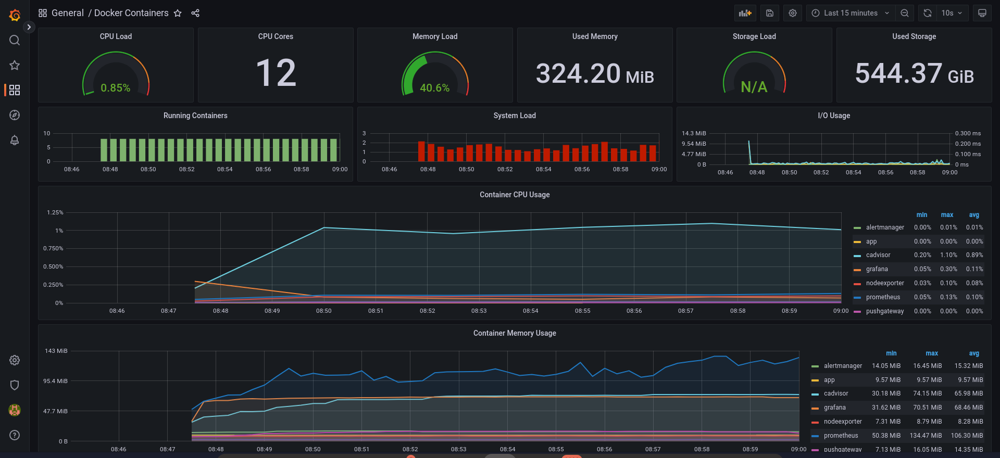
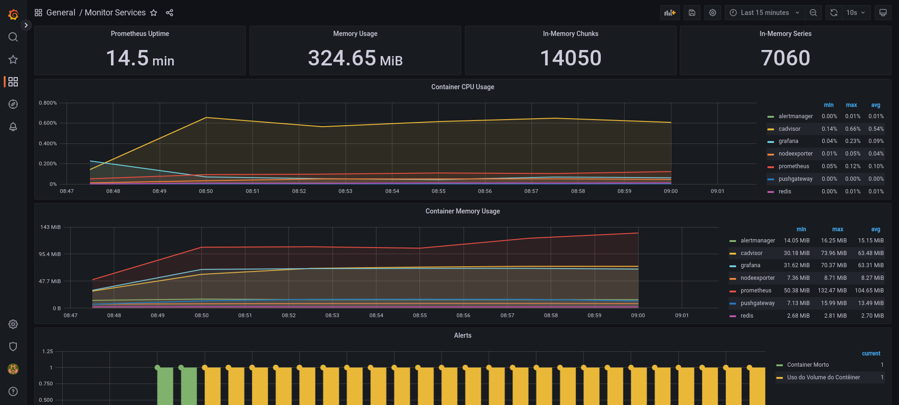
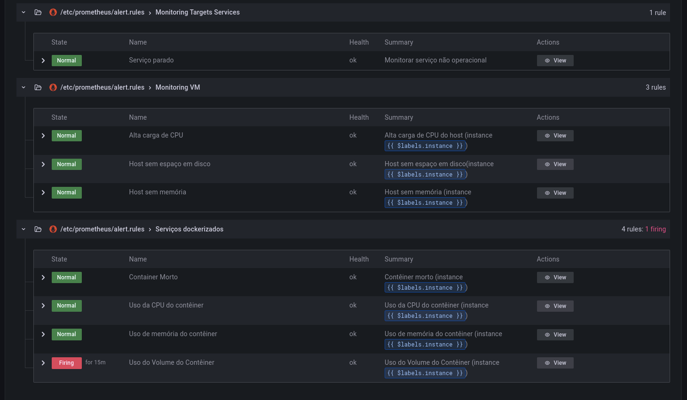
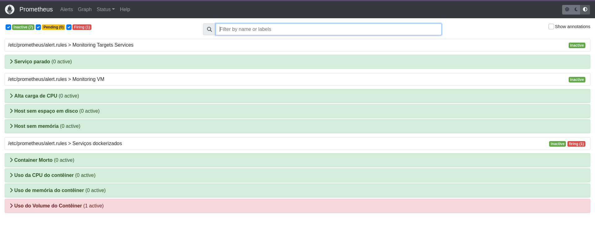
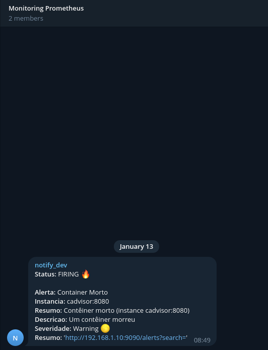

<h1 align="center">Monitoring - Stack Prometheus </h1>

<p align="center">
  
  
  
</p>

<p align="center">
  
</p>

## 🌱 Project

- Laboratório para teste de monitoramento de host e containers com prometheus.

## ✨ Tecnologias

- Docker
- Prometheus
- Alertmanager
- Grafana
- Cadvisor
- Node Exporter

## 🛠️ Etapas serem feitas

1. [ ] Criar token bot telegram e chat
2. [ ] Definir configuração do prometheus 
3. [ ] Criar regras de alertas para:
    - [ ] Services Targets
    - [ ] Host
    - [ ] Serviços Dockerizados
4. [ ] Criar templates de notificação para o alertmanager
5. [ ] Definir configuração do alertmanager para envio das notificações
6. [ ] Integração do Grafana com Prometheus e criação de dashboards para visualização das métricas

## ✨ Execução

- Adicionar `bot_token` e o `chat_id` no `./alertmanager/config.yml`

- SUbindo os serviços

```bash
docker-compose -d
```

```console
    Name                  Command                  State                        Ports                  
-------------------------------------------------------------------------------------------------------
alertmanager   /bin/alertmanager --config ...   Up             0.0.0.0:9093->9093/tcp,:::9093->9093/tcp
app            /docker-entrypoint.sh ngin ...   Up             0.0.0.0:8081->80/tcp,:::8081->80/tcp    
cadvisor       /usr/bin/cadvisor -logtostderr   Up (healthy)   0.0.0.0:8080->8080/tcp,:::8080->8080/tcp
grafana        /run.sh                          Up             0.0.0.0:3000->3000/tcp,:::3000->3000/tcp
nodeexporter   /bin/node_exporter --path. ...   Up             0.0.0.0:9100->9100/tcp,:::9100->9100/tcp
prometheus     /bin/prometheus --config.f ...   Up             0.0.0.0:9090->9090/tcp,:::9090->9090/tcp
pushgateway    /bin/pushgateway                 Up             0.0.0.0:9091->9091/tcp,:::9091->9091/tcp
redis          docker-entrypoint.sh redis ...   Up             0.0.0.0:6379->6379/tcp,:::6379->6379/tcp
```

## 📊 Dashboards

- Prometheus

<p align="center">
  
</p>

- Cadvisor

<p align="center">
  
</p>

- Grafana - Monitoring Host

<p align="center">
  
</p>

- Grafana - Monitoring Docker

<p align="center">
  
</p>

- Grafana - Monitoring Services

<p align="center">
  
</p>

## 🔥 Alertas

- Grafana - Alertas

<p align="center">
  
</p>

- Prometheus - Alertas

<p align="center">
  
</p>

- Telegram - Alertas

<p align="center">
  
</p>

 
## 📄 Licença
Esse projeto está sob a licença MIT. Veja o arquivo [LICENSE](LICENSE) para mais detalhes.

## 🙇 Referências