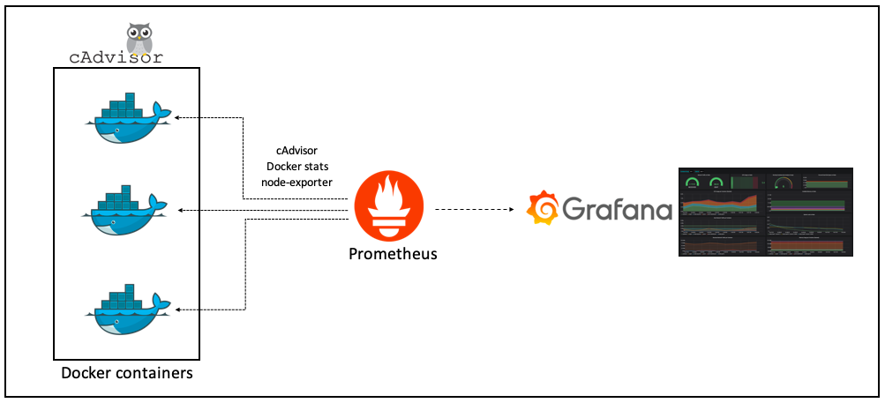

<h1 align="center">Monitoring - Stack Prometheus </h1>

<p align="center">
  
  
  
</p>

<p align="center">
  
</p>

## 🌱 Project

- Laboratório para teste de monitoramento de host e containers com prometheus.

## ✨ Tecnologias

- Docker
- Prometheus
- Alertmanager
- Grafana
- Cadvisor
- Node Exporter

## 🛠️ Etapas serem feitas


1. [x] [Subir Prometheus](./docker-compose.yml) [ Metrics Database ] `http://<host-ip>:9090`
    - [x] [Definir configuração do prometheus](./prometheus/config/prometheus.yml)
2. [x] [Subir Grafana](./docker-compose.yml) [ Visualização das métricas ] http://<host-ip>:3000
    - [x] [Criar arquivo de configuração do datasouce para integração automática com o Prometheus](./grafana/provisioning/datasources/datasource.yml)
    - [x] Criar arquivo `grafana.env` para credenciais seguido esse exemplo: [grafana-example.env](./grafana/grafana-example.env)
    - [x] [Criar dashboard para visualizar metricas dos contêiners](./grafana/provisioning/dashboards/docker_containers.json)
    - [x] [Criar dashboard para visualizar metricas dos hosts](./grafana/provisioning/dashboards/docker_host.json)
    - [x] [Criar dashboard para visualizar metricas dos targets](./grafana/provisioning/dashboards/monitor_services.json)
    - [X] [Documentação das dashboards criadas](./grafana/provisioning/dashboards/Readme.md)
3. [x] [Subir Node Exporter](./docker-compose.yml) [ Coletor de métricas do host ] `http://<host-ip>:9100`
4. [x] [Subir Cadvisor](./docker-compose.yml) [ Coletor de métricas do container ] `http://<host-ip>:8080`
5. [x] [Subir alertmanager](./docker-compose.yml) [ Gerenciamento de alertas ] `http://<host-ip>:9093`
    - [ ] Setup Alertas [`Andamento`]
      - [ ] Criar regras de alertas para:
        - [ ] [Services Targets](./prometheus/config/alert.rules) [`Andamento`]
        - [ ] [Host](./prometheus/config/alert.rules) [`Andamento`]
        - [ ] [Serviços Dockerizados](./prometheus/config/alert.rules) [`Andamento`]
        - [x] [Documentação dos alertas criados](./grafana/provisioning/alertas/Readme.md)
      - [ ] Receber notificação de alertas via Telegram [`Andamento`]
        - [x] [Criar token bot telegram e chat](https://telegram.me/BotFather)
        - [x] Criar arquivo `telegram.env` com informações do bot_token e chat_id baseado nesse exemplo [telegram-example.env](./alertmanager/telegram-example.env)
        - [x] [Criar templates de notificação para envio de notificações](./alertmanager/templates/telegram.tmpl) 
6. [x] [Configurar o k6 para teste de carga da aplicação](./k6/Readme.md)
7. [x] [Script para stress da CPU - Simular falhas e testar alertas](./chaos/Readme.md)

## ✨ Execução

- Adicionar `bot_token` e o `chat_id` no [config.yml](./alertmanager/config.yml)

- SUbindo os serviços

```bash
docker-compose up -d
```

```console
    Name                  Command                  State                        Ports                  
-------------------------------------------------------------------------------------------------------
alertmanager   /bin/alertmanager --config ...   Up             0.0.0.0:9093->9093/tcp,:::9093->9093/tcp
app            /docker-entrypoint.sh ngin ...   Up             0.0.0.0:8081->80/tcp,:::8081->80/tcp    
cadvisor       /usr/bin/cadvisor -logtostderr   Up (healthy)   0.0.0.0:8080->8080/tcp,:::8080->8080/tcp
grafana        /run.sh                          Up             0.0.0.0:3000->3000/tcp,:::3000->3000/tcp
nodeexporter   /bin/node_exporter --path. ...   Up             0.0.0.0:9100->9100/tcp,:::9100->9100/tcp
prometheus     /bin/prometheus --config.f ...   Up             0.0.0.0:9090->9090/tcp,:::9090->9090/tcp
```
 
## 📄 Licença
Esse projeto está sob a licença MIT. Veja o arquivo [LICENSE](LICENSE) para mais detalhes.

## 🙇 Referências