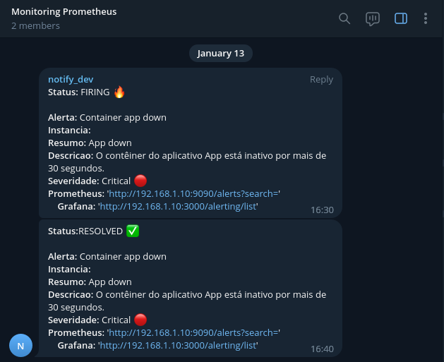

## Definição de alertas

Grupos de alertas criados e configurados no arquivo [alert.rules](../../../prometheus/config/alert.rules)

- Alvos de alertas de serviços de monitoramento `to do`
- Docker Host alerta o host `andamento`
- Docker Containers alerta contêineres `andamento`

## Alertas para a pilha de monitoramento
[ANDAMENTO]
## Alertas para o Host 
[ANDAMENTO]
## Alertas para os containers
[ANDAMENTO]

## 🔥 Alertas

- Grafana - Alertas

  

- Prometheus - Alertas

  

- Telegram - Alertas

  

