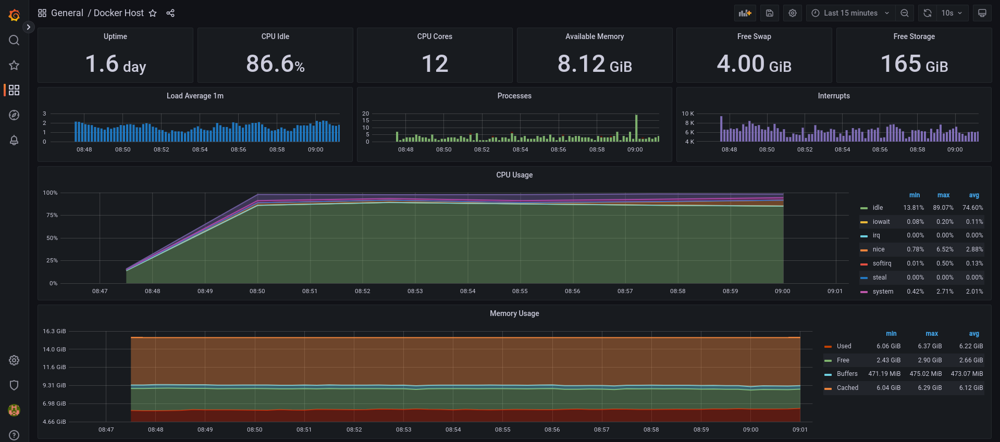
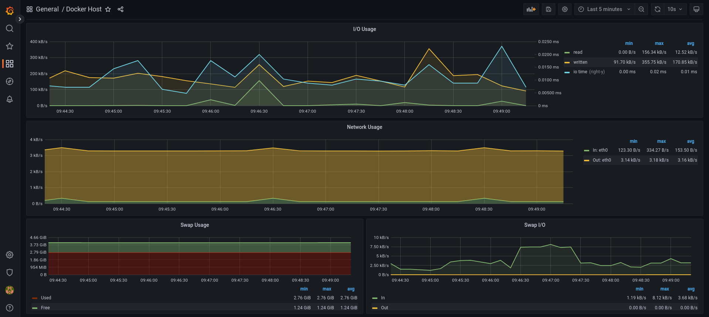
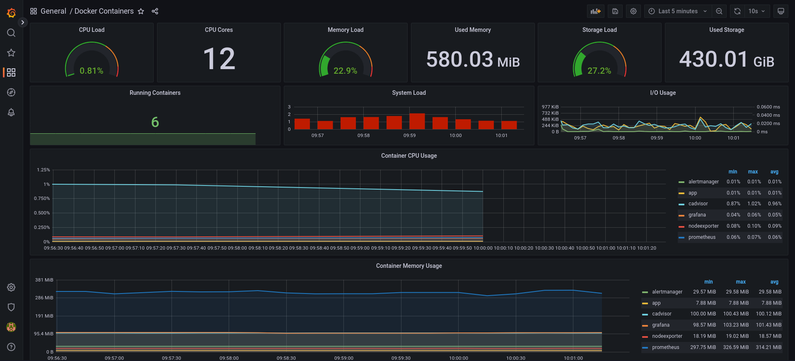
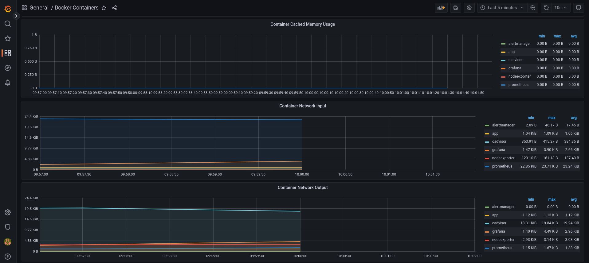
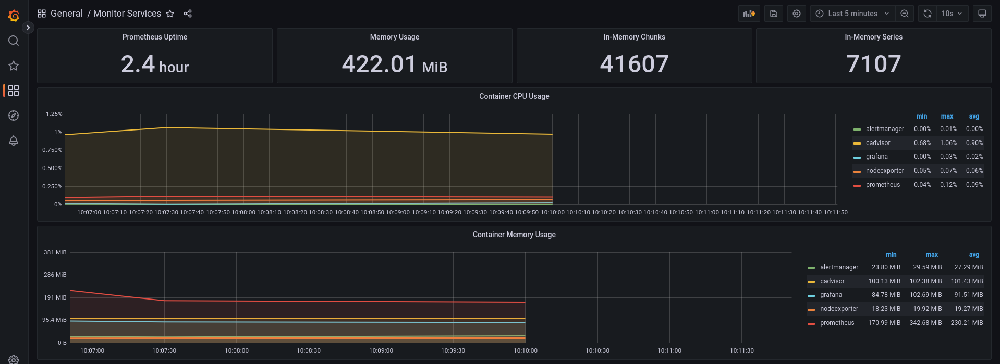
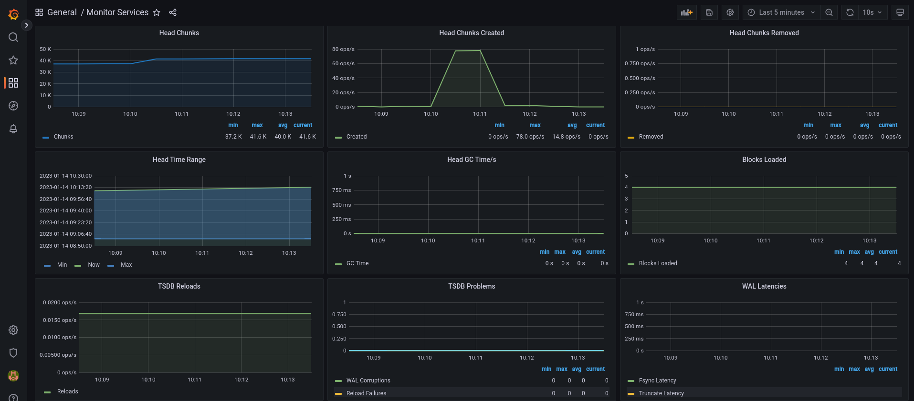
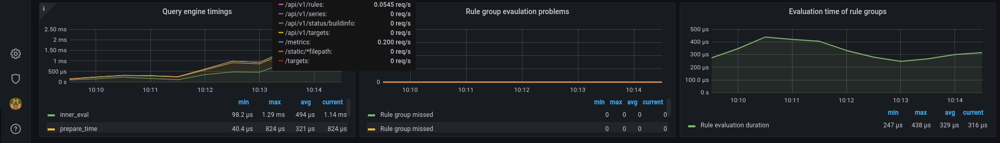

## 📊 Dashboards com Grafana


- Grafana 
  - User: admin
  - Password: admin
  - Url: http://localhost:3000

1. Monitoring Host Dashboard - [Configfile](./docker_host.json)

<p align="center">
  
  
</p>


O Docker Host Dashboard mostra as principais métricas para monitorar o uso de recursos do seu servidor:

- Tempo de atividade do servidor, porcentagem de ociosidade da CPU, número de núcleos da CPU, memória disponível, swap e armazenamento
- Gráfico de média de carga do sistema, em execução e bloqueado por gráfico de processos de IO, gráfico de interrupções
- Gráfico de uso da CPU por modo (guest, idle, iowait, irq, nice, softirq, steal, system, user)
- Gráfico de uso de memória por distribuição (usado, livre, buffers, em cache)
- Gráfico de uso de IO (ler Bps, ler Bps e tempo de IO)
- Gráfico de uso da rede por dispositivo (Bps de entrada, Bps de saída)
- Troque gráficos de uso e atividade

Para armazenamento e particularmente gráfico de armazenamento gratuito, você deve especificar o fstype na solicitação do gráfico grafana. Você pode encontrá-lo em grafana/dashboards/docker_host.json, na linha 480:

```console
"expr": "sum(node_filesystem_free_bytes{fstype=\"ext4\"})",
```

Você pode encontrar o valor certo para o seu sistema no Prometheus http://<host-ip>:9090iniciando esta solicitação:

```console
node_filesystem_free_bytes
```

2. Monitoring Containers Docker - [Configfile](./grafana/provisioning/dashboards/docker_containers.json)

<p align="center">
  
  
</p>

O Docker Containers Dashboard mostra as principais métricas para monitorar contêineres em execução:

- Carga total de CPU de contêineres, uso de memória e armazenamento
- Gráfico de contêineres em execução, gráfico de carga do sistema, gráfico de uso de E/S
- Gráfico de uso da CPU do contêiner
- Gráfico de uso de memória do contêiner
- Gráfico de uso de memória em cache do contêiner
- Gráfico de uso de entrada da rede de contêiner
- Gráfico de uso de saída da rede de contêiner

3. Monitoring Services - [Configfile](./grafana/provisioning/dashboards/monitor_services.json)

<p align="center">
  
  
  
  
  
</p>

O Monitor Services Dashboard mostra as principais métricas para monitorar os contêineres que compõem a pilha de monitoramento:

- Tempo de atividade do contêiner do Prometheus, monitoramento do - uso total da memória da pilha, blocos e séries de memória de armazenamento local do Prometheus
- Gráfico de uso da CPU do contêiner
- Gráfico de uso de memória do contêiner
- Pedaços do Prometheus para persistir e gráficos de urgência de persistência
- Prometheus chunks ops e gráficos de duração do ponto de verificação
- Taxa de ingestão de amostras do Prometheus, raspagens de destino e gráficos de duração de raspagem
- Gráfico de solicitações HTTP do Prometheus
- Gráfico de alertas do Prometheus